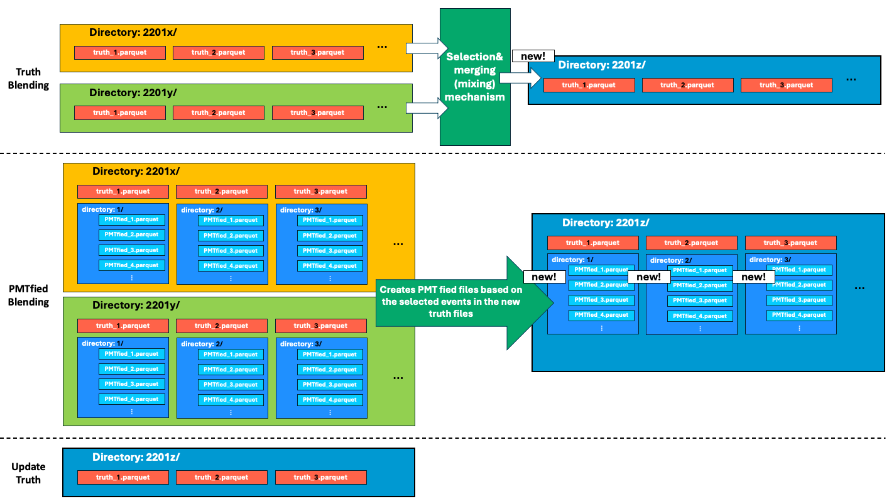
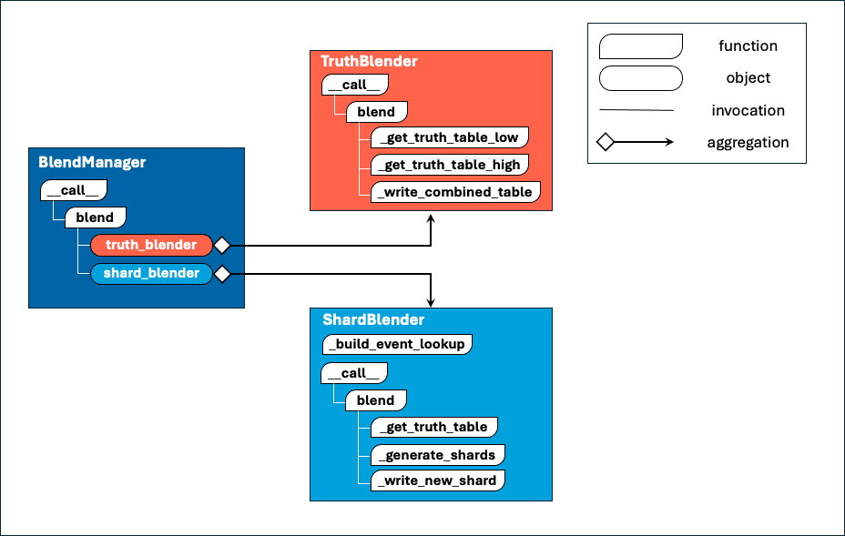

# IcePack Blender Module
> README generated by Gemini 2.5 pro 20250518
## Overview

 
The `Blender` module is responsible for combining and reorganizing particle event data, specifically focusing on "truth" data (simulated ground truth particle information) and "PMTfied shards" (data processed to simulate PhotoMultiplier Tube responses, stored in sharded Parquet files).

It handles scenarios where data from different energy ranges (e.g., low-energy and high-energy simulations) need to be merged into a unified dataset for further analysis or processing. The process ensures that both the truth information and the corresponding PMT data are consistent after blending.

## Core Components

The module consists of three main classes:
 
### 1. `TruthBlender`

-   **Purpose**: Combines truth data from low-energy and high-energy sources.
-   **Key Operations**:
    -   Filters low-energy events based on a specified `energy_cutoff`.
    -   Balances the number of events from low and high-energy datasets by selecting an equal number of events from each (specifically, `2 * min(n_low, n_high)` events in total).
    -   Interleaves the selected events from both energy ranges to create a mixed dataset.
    -   Updates event metadata columns like `subdirectory_no` (to a new common value for the combined dataset) and `part_no` (re-assigned for the new parts) to reflect the new combined structure.
    -   Splits the resulting combined truth table into multiple output "parts" (Parquet files), each containing a defined number of events (`n_events_per_part`).
    -   Generates a JSON receipt detailing the number of events available from each energy range before selection and the total events actually combined.

### 2. `ShardBlender`

-   **Purpose**: Rebuilds and reorganizes PMTfied shard files to correspond with the newly blended truth data produced by `TruthBlender`.
-   **Key Operations**:
    -   Reads the blended truth files (created by `TruthBlender`) to understand the new event sequence and structure for each part.
    -   Uses an internal lookup, built during initialization from the original (pre-blending) truth files associated with low and high energy PMTfied shards. This lookup maps `event_no` to its original PMTfied data location (file path, slice start, slice length).
    -   For each event in a blended truth part, it retrieves these PMTfied data slices from their original low-energy and high-energy shard files.
    -   Concatenates these slices to form new PMTfied shard files. Events are grouped into new shards, each containing up to `n_events_per_shard` events.
    -   Updates the blended truth files (processed by `TruthBlender`) with new `shard_no` and `offset` information, pointing to the location of each event's data within the newly created PMTfied shards.

### 3. `BlendManager`

-   **Purpose**: Orchestrates the entire blending process by coordinating `TruthBlender` and `ShardBlender`.
-   **Workflow**:
    1.  Initializes with parameters such as the main `source_dir`, `EnergyRange` enums for low, high, and the target combined datasets, particle `Flavour`, event counts per part (`n_events_per_part` for truth output) and per shard (`n_events_per_shard` for PMTfied output), and the `energy_cutoff` for `TruthBlender`.
    2.  Calls `TruthBlender` to perform the blending of truth files. This reads from the low and high energy subdirectories and creates a new set of truth files in a "combined" subdirectory.
    3.  Calls `ShardBlender` to process the PMTfied shards. `ShardBlender` uses the output of `TruthBlender` (the new truth files in the combined directory) and the original PMTfied shards from low/high energy directories to create new, reorganized PMTfied shards in the combined directory. It also updates the truth files from step 2 with the new shard information.

## Usage

The primary way to use the blending functionality is through the `BlendManager`.

```python
import os
from IcePack.Enum.Flavour import Flavour
from IcePack.Enum.EnergyRange import EnergyRange # Assuming EnergyRange.get_subdir is defined
from IcePack.Blender.BlendManager import BlendManager

# --- Assuming EnergyRange Enum is defined something like this ---
# from enum import Enum
# class EnergyRange(Enum):
#     LOW_ENERGY_EXAMPLE = "NuE_10TeV_1PeV_SetA"
#     HIGH_ENERGY_EXAMPLE = "NuE_1PeV_1EeV_SetB"
#     COMBINED_ENERGY_EXAMPLE = "NuE_10TeV_1EeV_CombinedSet"
#
#     @staticmethod
#     def get_subdir(energy_range_enum_val, flavour_enum_val):
#         # This is a simplified example; your actual get_subdir might be more complex
#         # or the enum value itself might be the directory name.
#         return f"{flavour_enum_val.name}_{energy_range_enum_val.value}"
# ---------------------------------------------------------------

# Define parameters
source_directory = "/path/to/your/data"
flavour_to_process = Flavour.NU_E # Example Flavour from IcePack.Enum.Flavour

# Define energy ranges (using placeholder names for EnergyRange enum values)
# These enums would map to specific subdirectory naming conventions via EnergyRange.get_subdir
low_energy_range_enum = EnergyRange.LOW_ENERGY_EXAMPLE # Replace with actual Enum member
high_energy_range_enum = EnergyRange.HIGH_ENERGY_EXAMPLE # Replace with actual Enum member
combined_energy_range_enum = EnergyRange.COMBINED_ENERGY_EXAMPLE # Replace with actual Enum member

# Instantiate the manager
manager = BlendManager(
    source_dir=source_directory,
    energy_range_low=low_energy_range_enum,
    energy_range_high=high_energy_range_enum,
    energy_range_combined=combined_energy_range_enum,
    flavour=flavour_to_process,
    n_events_per_part=30000, # For TruthBlender output parts
    n_events_per_shard=3000,  # For ShardBlender output shards
    energy_cutoff=1e5 # e.g., 100 TeV, for filtering low_energy events in TruthBlender
)

# Run the blending process
manager.blend()
# or manager() can be called as it has __call__ method
```