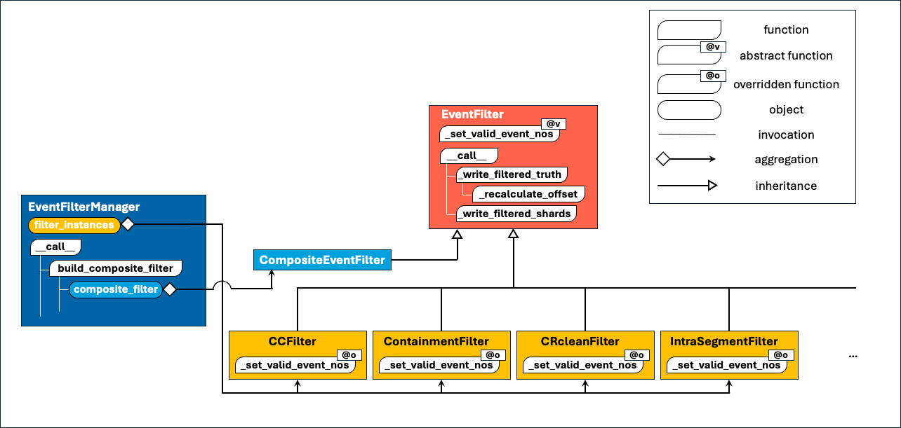

# IcePack EventFilter Module
> README generated by Gemini 2.5 pro 20250518

## Overview
 
The `EventFilter` module provides tools to selectively filter particle events based on a variety of physics-based or geometry-based criteria. It operates on the output of the `PMTfication` module, processing both the truth tables (`truth_*.parquet`) and the PMTfied data shards (`PMTfied_*.parquet`).

The primary goal is to allow users to refine datasets for specific analyses by including only events that meet certain conditions. This is managed through a main `EventFilterManager` and a collection of individual filter classes.

## Core Concepts

### `EventFilter` (Abstract Base Class)
The `EventFilter` class ([EventFilter.py](EventFilter.py)) is an abstract base class that defines the common structure and functionality for all specific event filters.
-   **Initialization**: Takes source and output directory information, along with `subdir_no` and `part_no` to identify the data to be processed.
-   **Event Selection**: Each concrete filter subclass must implement the `_set_valid_event_nos` method. This method is responsible for determining the set of `event_no` that pass the specific filter's criteria, typically by analyzing the `source_truth_file`.
-   **Filtering Process (`__call__`)**: When an `EventFilter` instance is called:
    1.  It writes a new, filtered truth file (`_write_filtered_truth`) containing only the rows corresponding to `valid_event_nos`. The `offset` column in this new truth table is recalculated based on the surviving events and their `N_doms` within each shard.
    2.  It processes each PMTfied shard file associated with the input part (`_write_filtered_shards`), keeping only data related to the `valid_event_nos`, and saves these to a corresponding output directory.
-   **Receipt Generation**: Provides a `get_receipt_info` method to summarize the filtering results, such as initial and final event counts and survival ratios.

### `EventFilterManager`
The `EventFilterManager` ([EventFilterManager.py](EventFilterManager.py)) is the main user interface for applying one or more filters to a dataset part.
-   **Initialization**: It takes source and output base directories, `subdir_no`, `part_no`, a dictionary of filter classes to apply (e.g., `{"cc": CCFilter, "contain": ContainmentFilter}`), and an optional dictionary of keyword arguments for each filter.
-   **Dynamic Output Path**: It constructs a unique output subdirectory path based on the combination of filters applied and their parameters (referred to as a `filter_keyword`). This ensures that results from different filter chains are stored separately.
-   **Filter Instantiation**: It instantiates the specified filter classes, passing the necessary parameters.
-   **Composite Filtering**:
    -   If a single filter is specified, the manager wraps it in a `CompositeEventFilter`.
    -   If multiple filters are specified, the manager first gets the `valid_event_nos` from each individual filter. It then calculates the intersection of these sets to find events that pass *all* filters. This final set of `valid_event_nos` is then used to initialize a `CompositeEventFilter`.
-   **Execution**: Calling the `EventFilterManager` instance executes the `CompositeEventFilter`, which applies the combined filtering logic.
-   **Unified Receipt**: It generates a JSON receipt file summarizing the outcome of the entire filter chain for the processed part, including execution time and event reduction statistics.

### `CompositeEventFilter`
The `CompositeEventFilter` ([CompositeEventFilter.py](CompositeEventFilter.py)) acts as a wrapper that applies a pre-determined set of `valid_event_nos` to the data. It's primarily used internally by the `EventFilterManager` to execute the filtering logic based on the outcome of one or more individual filters. Its `_set_valid_event_nos` method is a no-op, as the valid events are provided during its instantiation.

## Available Filters

The module includes several concrete filter implementations:

* **`CCFilter` ([CCFilter.py](CCFilter.py))**:
    * Filters for Charged-Current (CC) neutrino interactions.
    * Selects events where the `InteractionType` field in the truth table is equal to `1`.

* **`ContainmentFilter` ([ContainmentFilter.py](ContainmentFilter.py))**:
    * Selects events that are fully contained within a predefined IceCube volume.
    * Relies on the `isWithinIceCube` column (presumably generated during PMTfication by `PMTTruthFromTruth`) in the truth table.

* **`IntraIceCubeSegmentFilter` ([IntraIceCubeSegmentFilter.py](IntraIceCubeSegmentFilter.py))**:
    * Selects events where a significant portion of the primary lepton's track segment lies within the IceCube volume.
    * Filters based on the `post_vertex_intraIceCube_segment` column in the truth table, requiring it to be greater than a configurable `min_travel_distance`.

* **`PureNeutrinoEventFilter` ([PureNeutrinoEventFilter.py](PureNeutrinoEventFilter.py))**:
    * Filters events to retain only those identified as genuine neutrino interactions, aiming to remove cosmic-ray-induced or other background events.
    * It achieves this by comparing the `RunID` and `EventID` from the input truth table against pre-compiled lists of "pure neutrino" event specifiers stored in external CSV files.
    * **Note**: This filter uses a hardcoded path (`/lustre/hpc/project/icecube/HE_Nu_Aske_Oct2024/clean_events_dict/`) to access these CSV files.

## How Filtering Works (General Flow for a Single Filter)

1.  **Initialization**: An instance of a specific filter (e.g., `CCFilter`) is created.
2.  **Determine Valid Events**: The filter's `_set_valid_event_nos` method is called. This method reads the source `truth_{part_no}.parquet` file and applies its specific logic (e.g., checking `InteractionType`) to compile a set of `event_no` that pass the filter.
3.  **Filter Truth Data**: The `_write_filtered_truth` method (from the `EventFilter` base class) reads the original truth table, selects only the rows corresponding to the `valid_event_nos`, recalculates the `offset` column for the selected events, and writes the filtered truth table to the designated output directory.
4.  **Filter PMTfied Shards**: The `_write_filtered_shards` method (from the `EventFilter` base class) iterates through all `PMTfied_*.parquet` files in the source part's subdirectory. For each shard file, it selects data corresponding to the `valid_event_nos` and writes the filtered PMTfied data to a new shard file in the output directory.

When multiple filters are used via `EventFilterManager`, this process is effectively done for each filter to determine its individual set of valid events. The manager then finds the intersection of these sets, and the `CompositeEventFilter` applies this final intersection to write the output files.

## Usage

The recommended way to apply filters is through the `EventFilterManager`.

```python
import time
from IcePack.EventFilter.EventFilterManager import EventFilterManager
from IcePack.EventFilter.CCFilter import CCFilter
from IcePack.EventFilter.ContainmentFilter import ContainmentFilter
from IcePack.EventFilter.IntraIceCubeSegmentFilter import IntraIceCubeSegmentFilter

# Define parameters
source_directory = "/path/to/pmtfied_data"  # Base directory where subdir_no folders reside
output_directory = "/path/to/filtered_data" # Base directory for filtered output
subdir_to_process = 12345 # Example subdirectory number
part_to_process = 1       # Example part number

# Define which filters to apply and their parameters
# Keys are aliases used in naming the output folder
filters_to_apply = {
    "cc": CCFilter,
    "contain": ContainmentFilter,
    "seg": IntraIceCubeSegmentFilter,
}

filter_arguments = {
    "seg": {"min_travel_distance": 250.0} # Arguments for IntraIceCubeSegmentFilter
    # Add arguments for other filters if needed, e.g. "cc": {"some_cc_param": True}
}

# Instantiate the EventFilterManager
manager = EventFilterManager(
    source_dir=source_directory,
    output_dir=output_directory,
    subdir_no=subdir_to_process,
    part_no=part_to_process,
    filter_classes=filters_to_apply,
    filter_kwargs=filter_arguments
)

# Run the filtering process
start_time = time.time()
manager() # Calls the __call__ method
end_time = time.time()

# Generate a receipt for the filtering process
manager.generate_receipt(start_time, end_time)

# Example output directory structure:
# /path/to/filtered_data/
#   cc_contain_seg_10.0/  (filter_keyword based on applied filters and params)
#     12345/              (subdir_no)
#       truth_1.parquet
#       [Receipt]12345_1.json
#       1/                  (part_no)
#         PMTfied_1.parquet
#         PMTfied_2.parquet
#         ...
```