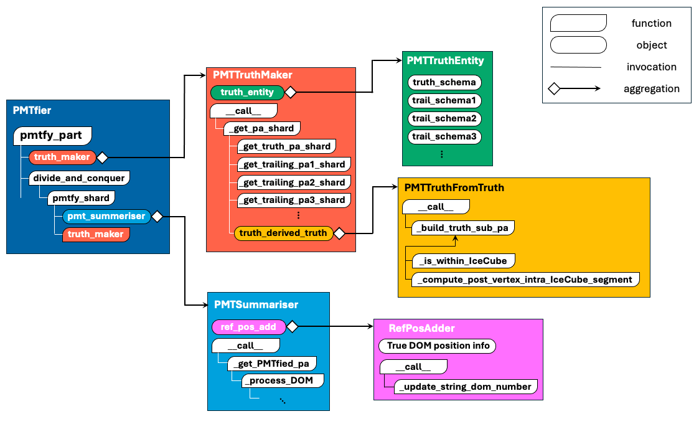
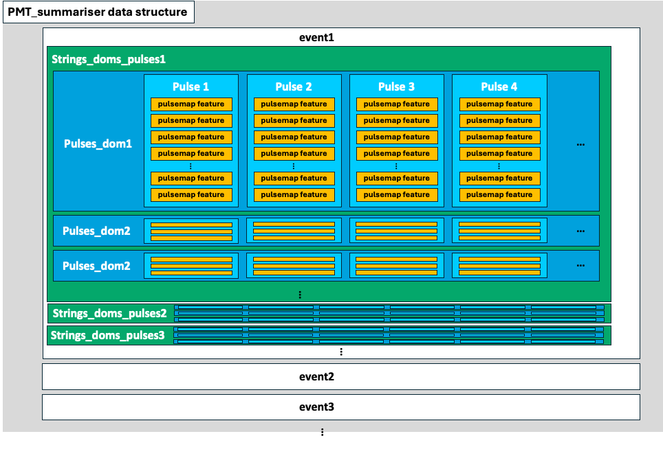
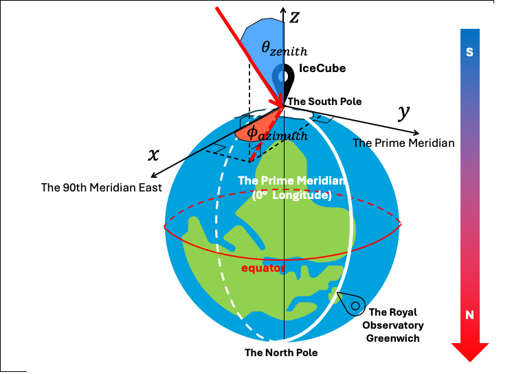
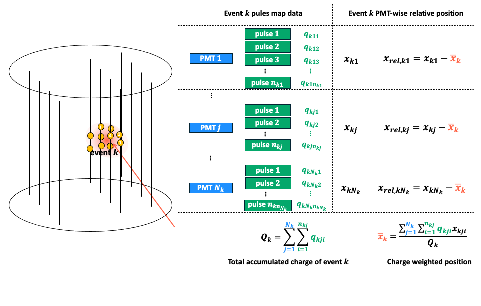
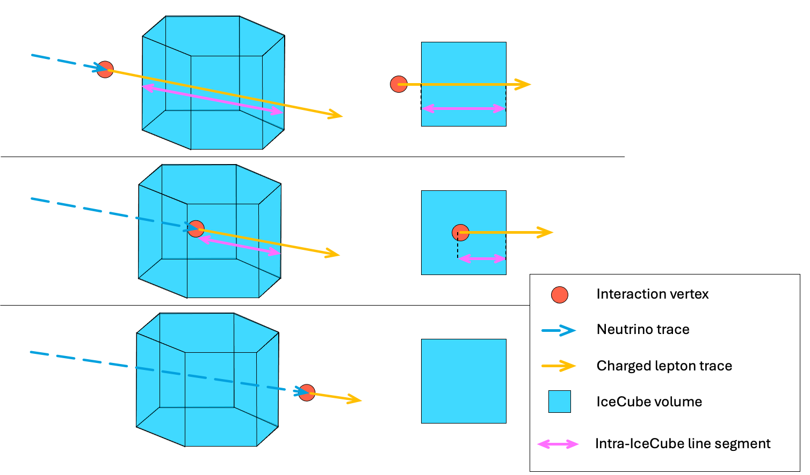
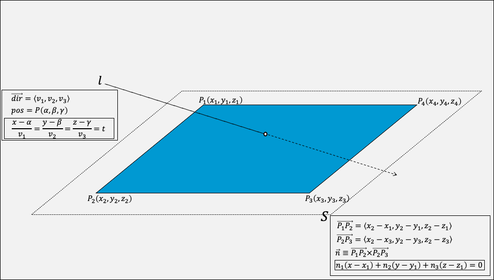
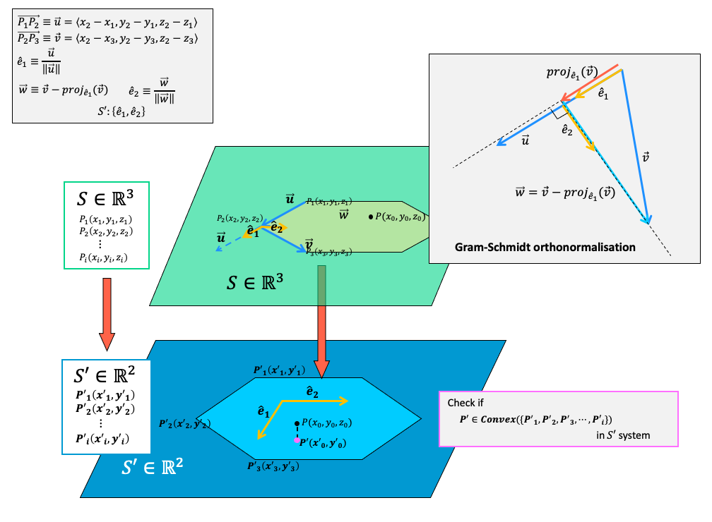

# IcePack PMTfication Module
> README generated by Gemini 2.5 pro 20250518
## Overview

The `PMTfication` module is designed to transform raw particle interaction data, typically stored as "pulsemaps" in IceCube simulation outputs, into PhotoMultiplier Tube (PMT)-wise summarized representations. This process, referred to as "PMTfication," also involves generating comprehensive truth tables that link the PMTfied data to ground truth simulation parameters.

The primary goal is to prepare datasets that are structured for detailed analysis and can be readily used as input for machine learning models. The module is built to handle potentially large datasets by processing them in parts and shards and is designed to be adaptable to different source data layouts through a configurable `SourceLayout` system.

## Core Components and Workflow

The main orchestrator of the PMTfication process is the `PMTfier` class. It processes data from source SQLite database files (referred to as "parts") and outputs PMTfied data and truth tables in Apache Parquet format.

The typical workflow for processing a single source data part (e.g., `merged_part_X.db`) is as follows:

1.  **Initialization (`PMTfier`)**:
    * An instance of `PMTfier` is created with paths to the source and destination directories, a `SourceLayout` object defining the structure of the input data, and a `SummaryMode` that dictates how PMT data should be summarized.
    * The `SourceLayout` specifies table names for pulsemaps, truth, and other relevant metadata within the source SQLite files, as well as sharding parameters.

2.  **Part Processing (`PMTfier.pmtfy_part`)**:
    * `PMTfier` processes one source database file (a "part") at a time.
    * Within a part, events are processed in batches called "shards". The number of events per shard is typically defined by the `SourceLayout`.

3.  **Shard Processing (`PMTfier.pmtfy_shard` and `_divide_and_conquer_part`)**:
    For each shard (batch of event numbers):
    
    * **PMT Data Summarization (`PMTSummariser`)**:
        * The `PMTSummariser` class is the core engine for converting raw pulse data for each event into a summarized, PMT-centric format.
        * **DOM Identification (`ReferencePositionAdder`)**: Before summarization, if the pulsemap data doesn't have consistent `string` and `dom_number` identifiers, `PMTSummariser` internally uses `ReferencePositionAdder`. This tool adds/updates these identifiers by matching DOM coordinates (dom_x, dom_y, dom_z) against a reference list of known DOM positions (from `unique_string_dom_completed.csv`), ensuring that each physical DOM is consistently identified. This step is crucial for creating a coherent PMT-wise dataset.
        * `PMTSummariser` then extracts various features from the pulses recorded by each PMT for each event. These features can include charge statistics (e.g., Q25, Q75, Qtotal), timing information (e.g., T10, T50, sigmaT), and potentially geometric or other advanced features depending on the selected `SummaryMode`.
        * The output of `PMTSummariser` is a PyArrow Table containing the summarized features for all PMTs that recorded hits in the current shard's events. This table is then saved as a `PMTfied_{shard_no}.parquet` file.
    * **Enhanced Event ID Generation**: `PMTfier` modifies the original `event_no` to create a globally unique "enhanced event ID". This new ID typically incorporates information about the data family (e.g., Snowstorm, Corsika), the source subdirectory, the part number, and the original event number. The original event number is preserved as `original_event_no`. This enhancement is applied to both the PMTfied data and the truth data.
    * **Truth Table Generation (`PMTTruthMaker`)**:
        * After the PMTfied data for a shard is created, `PMTTruthMaker` is invoked to generate a corresponding truth table.
        * **Summary-Derived Truth (`PMTTruthFromSummary`)**: First, `PMTTruthFromSummary` calculates some event-wise features directly from the newly created PMTfied data shard, such as the maximum inter-PMT distance (`max_interPMT_distance`) within an event.
        * `PMTTruthMaker` then queries the original source database for various truth tables specified in the `SourceLayout` (e.g., `Truth`, `GNHighestEInIceParticle`, `GNHighestEDaughter`, `MCWeightDict`).
        * It combines this fetched truth information with "receipt" data (like the enhanced `event_no`, `subdirectory_no`, `part_no`, `shard_no`, `N_doms` per event, and `offset` within the shard) and the features derived by `PMTTruthFromSummary`.
        * **Truth-Derived Truth (`PMTTruthFromTruth`)**: `PMTTruthMaker` also calls `PMTTruthFromTruth` to compute additional truth features based on existing truth columns. Examples include checking if a particle interaction vertex is within the IceCube detector volume (`isWithinIceCube`) or calculating the segment of a particle's track that lies within the detector (`post_vertex_intraIceCube_segment`).
        * The schemas for these truth tables, including data types and default values for missing data, are defined in `PMTTruthEntity`.
        * The resulting truth information for the shard is a PyArrow table.

4.  **Consolidation and Output**:
    * The truth tables from all shards within a part are concatenated by `PMTfier`.
    * This consolidated truth table for the entire part is saved as `truth_{part_no}.parquet` in the destination directory, alongside a subdirectory for that part containing all its `PMTfied_{shard_no}.parquet` files.

## Key Features

* **Modular PMT Data Summarization**: `PMTSummariser` provides flexible feature extraction from pulsemaps, configurable via `SummaryMode` (e.g., `CLASSIC`, `GEOMETRIC`, `EQUINOX`) to generate different sets of PMT features. (Equinox has nothing to do with the equinox. It needs to be renamed to something more meaningful😅)
* **Comprehensive Truth Generation**: A multi-stage process (`PMTTruthMaker`, `PMTTruthFromSummary`, `PMTTruthFromTruth`) assembles detailed truth tables, drawing from original simulation truth and deriving new, useful labels. `PMTTruthEntity` centralizes the schema definitions for these tables.
* **Adaptable Data Source Handling**: The `Layout` system (`SourceLayout.py`, `CorsikaLayout.py`, `SnowstormLayout.py`) allows `PMTfier` to work with different input data structures by defining where to find specific tables and how files are named. Users can create custom layouts by inheriting from `SourceLayout` or `FlavouredSourceLayout`.
* **Globally Unique Event Identifiers**: Ensures that events can be uniquely identified across different files, datasets, and simulation types.
* **Standardized DOM Identification**: `ReferencePositionAdder` ensures that PMT hits are associated with a consistent (string, dom_number) pair, crucial for building accurate PMT-wise datasets, especially when source data might have slight variations in DOM coordinates.

---
# Feature calculation logic
### IceCube coordinates

### Relative position calculation
 

### Post-vertex intra-IceCube segment
  

  

---

## Usage

The main entry point for using the PMTfication module is the `PMTfier` class.

```python
from IcePack.PMTfication.PMTfier import PMTfier
from IcePack.PMTfication.Layout.SnowstormLayout import SnowstormLayout # Or your custom layout
from IcePack.Enum.SummaryMode import SummaryMode
from IcePack.Enum.Flavour import Flavour
from IcePack.Enum.EnergyRange import EnergyRange

# Example: Define a source layout (e.g., for Snowstorm data)
# This assumes SnowstormLayout.layouts has been populated as shown in its file.
# You would typically select one specific layout instance.
example_flavour = Flavour.E
example_energy_range = EnergyRange.ER_10_TEV_1_PEV
source_layout_instance = SnowstormLayout.from_flavour_energy(example_flavour, example_energy_range)

if source_layout_instance is None:
    raise ValueError(f"Layout not found for {example_flavour}, {example_energy_range}")

# Instantiate PMTfier
pmtfier_instance = PMTfier(
    source_root="/path/to/source/databases", # Directory containing family subdirs like 'Snowstorm'
    source_layout=source_layout_instance,     # The specific layout for the data to be processed
    dest_root="/path/to/destination/pmtfied_data",
    summary_mode=SummaryMode.CLASSIC # Or SummaryMode.GEOMETRIC, SummaryMode.EQUINOX
)

# Process a specific part (e.g., part number 1)
# This corresponds to a file like 'merged_part_1.db' in the source_layout.subdir
part_number_to_process = 1
pmtfier_instance(part_no=part_number_to_process)

# This will create:
# /path/to/destination/pmtfied_data/
#   [source_layout.subdir]/                 (e.g., "22014" for the example layout)
#     truth_1.parquet
#     1/                                    (subdirectory for part_no 1)
#       PMTfied_1.parquet
#       PMTfied_2.parquet
#       ...
```