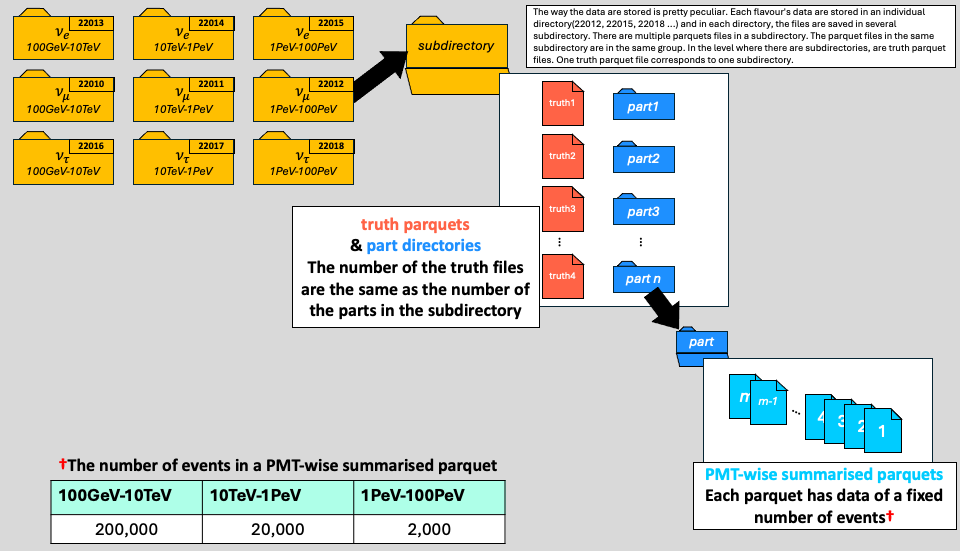

## Welcome to 
<pre style="color: #51ADDA">
██╗ ██████╗███████╗██████╗  █████╗  ██████╗██╗  ██╗
██║██╔════╝██╔════╝██╔══██╗██╔══██╗██╔════╝██║ ██╔╝
██║██║     █████╗  ██████╔╝███████║██║     █████╔╝
██║██║     ██╔══╝  ██╔═══╝ ██╔══██║██║     ██╔═██╗ 
██║╚██████╗███████╗██║     ██║  ██║╚██████╗██║  ██╗
╚═╝ ╚═════╝╚══════╝╚═╝     ╚═╝  ╚═╝ ╚═════╝╚═╝  ╚═╝🏃🚶
                                                   
⚙️ A Python Toolkit for IceCube Neutrino Data Processing🧊
</pre>
# IceCube PMT-wise Aggregation and Compression Kit


IcePack is a Python-based toolkit designed for processing, preparing, and managing simulation data from the IceCube neutrino observatory. It provides a suite of tools to convert pulse-wise data to PhotoMultiplier Tube (PMT)-wise summarised data for analysis or machine learning with heavy computations. This includes not only the summarisation module(PMTfication) but also the data selection based on truth label(EventFilter) and mixing of data from various sources or energy regimes(EventBlender). The whole package is designed based on the [SnowStorm MC data- not public, IceCube account needed :/](https://wiki.icecube.wisc.edu/index.php/SnowStorm_MC#File_Locations). See this illustration of the data storage format.  


---

## Key Features

- **PMTfication**: Transforms raw pulsemap data (typically from detector simulations) into summarised PMT-wise features.  
- **Advanced Event Filtering**: Provides a flexible framework to select events based on physics or geometric criteria (e.g., interaction type, detector containment).  
- **Data Blending**: Merges and reorganises distinct datasets (e.g., low-energy and high-energy simulations), ensuring consistency between truth information and PMT data.  
- **Layout Abstraction**: Adapts to different source data formats and structures via a configurable "Layout" system.  
- **Output Formats**: Uses Apache Parquet primarily for storing processed data, ensuring efficiency and compatibility with modern data analysis tools.
- **Flavour and Energy Range**: Supports event classification by flavour (e.g., electron, muon, tau) and energy range, facilitating targeted analyses.

---

## Modules Overview

IcePack consists of several core modules:

- **IcePack/PMTfication/**  
  Converts raw simulation pulsemaps (often stored in SQLite databases) into per-PMT summarised features and generates extensive truth tables linking events to ground truth and derived labels.  
  Key class: `PMTfier`  
  *(See IcePack/PMTfication/README.md for details)*

- **IcePack/Blender/**  
  Tools to combine different datasets, such as merging low-energy and high-energy simulations. Ensures blended truth tables and PMTfied data shards remain coherent.  
  Key class: `BlendManager`  
  *(See IcePack/Blender/README.md for details)*

- **IcePack/EventFilter/**  
  Framework for applying event selection criteria based on interaction type, geometry, and purity of neutrino events. Manages filter chains applied to truth and PMTfied data.  
  Key class: `EventFilterManager`  
  *(See IcePack/EventFilter/README.md for details)*

- **IcePack/Enum/**  
  Common enumeration types used throughout IcePack, including `Flavour`, `EnergyRange`, and `SummaryMode`. Referenced by various modules like PMTfication and Blender.

- **IcePack/ReferencePosition/**  
  Contains reference data such as Digital Optical Module (DOM) positions. For example, `unique_string_dom_combinations_completed.csv` supports consistent DOM identification within PMTfication.

---

## Directory Structure

```bash
├── IcePack/                    # Core library code
│   ├── PMTfication/            # PMT-level data conversion and truth generation
│   │   ├── Layout/             # Source data layout definitions
│   │   └── README.md
│   ├── Blender/                # Dataset blending module
│   │   └── README.md
│   ├── EventFilter/            # Event filtering module
│   │   └── README.md
│   ├── Enum/                   # Enumeration types
│   └── ReferencePosition/      # Reference data (e.g., DOM positions)
├── examples/                   # Example scripts and usage demos
│   ├── 1.PMTfy.py
│   └── PMTfy_by_part.sh
├── git_include/                # Git-related include files (e.g., hooks)
├── LICENSE                     # Project license
├── pyproject.toml              # Build and dependency info
└── README.md                   # This file
```
## Getting Started

### Prerequisites

IcePack is a Python project requiring Python 3.9 or higher. Dependencies are managed via `pyproject.toml` and include libraries such as PyArrow, NumPy, SciPy, scikit-learn, tqdm, and others.

### Installation

1. Clone the repository:

```bash
git clone https://github.com/KUcyans/IcePack.git
cd IcePack
```
2. Install the package and dependencies:
```bash
pip install .
# Or, for development, install in editable mode:
pip install -e .
```
3. (Optional) To install development tools such as black and flake8 for code formatting and linting, run:

```bash
pip install black flake8
```

## Usage

Each core module has a primary manager class to drive its functionality:

- `PMTfier` for PMTfication  
- `BlendManager` for dataset blending  
- `EventFilterManager` for event filtering  

### Typical Workflow

1. **PMTfication**: Process raw simulation data using `PMTfier` to produce PMT-summarised data and truth tables.  
2. **Blending (Optional)**: Combine multiple datasets (e.g., from different energy regimes) using `BlendManager`.  
3. **Filtering (Optional)**: Refine datasets by applying event selection criteria with `EventFilterManager`.

Detailed instructions and examples are available in the module-specific README files:

- `IcePack/PMTfication/README.md`  
- `IcePack/Blender/README.md`  
- `IcePack/EventFilter/README.md`  

The `examples/` directory contains demonstration scripts such as `1.PMTfy.py`.

---

### Source Data Layouts

PMTfication relies on `SourceLayout` classes (located in `IcePack/PMTfication/Layout/`) to interpret input data structures. Predefined layouts for Corsika and Snowstorm data are provided. For other formats, users should implement a custom layout by subclassing `SourceLayout`.

---

## Development and Code Style

This project uses `black` and `flake8` for formatting and linting. Git hooks are configured under `git_include/` to run these checks automatically.

## License

[](LICENSE)  

---
